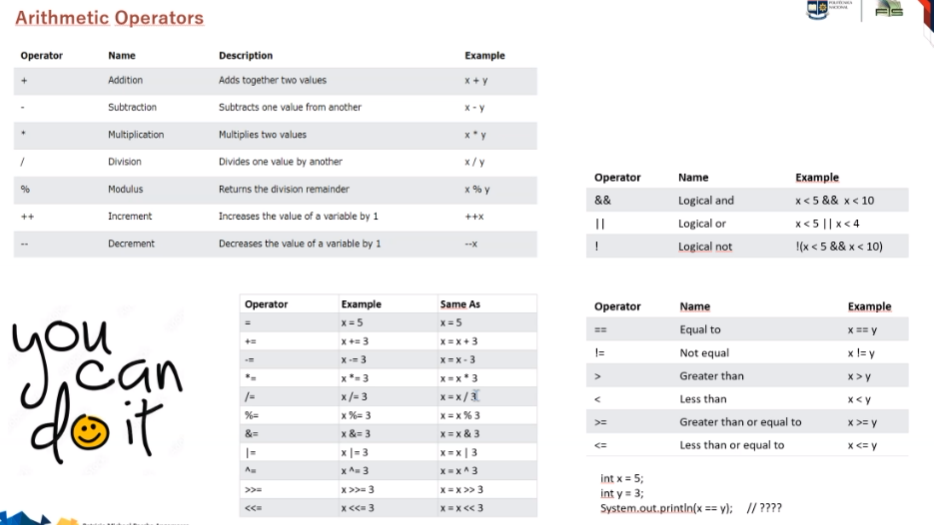

## Clase

**Static**

- Significa que no es dinamica, que solo esta en un bloque de memoria. 

- Genera un solo bloque de memoria.

- Sirve para las variables.
    ej:
    public static tipo_dato;
    public static Mujer oMujer;
    public static int PI = 3,14;

- Se los necesita porque a veces se requiere un valor unico.

- Por ejemplo PI, es un valor universal (una constante) y para no desperdiciar memoria al tener que crearse muchas veces, se lo crea como estatico para que todos puedan acceder a el, sin necesidad de acceder a mas espacios de memoria.

- Cuando se crean staticos, estos pueden ser:

- Estaticos de lectura: uso del *final*

public static final float PI = 3,14;

- Estaticos de lectura y escritura

public static Mujer oMujer;

- <rsc>

